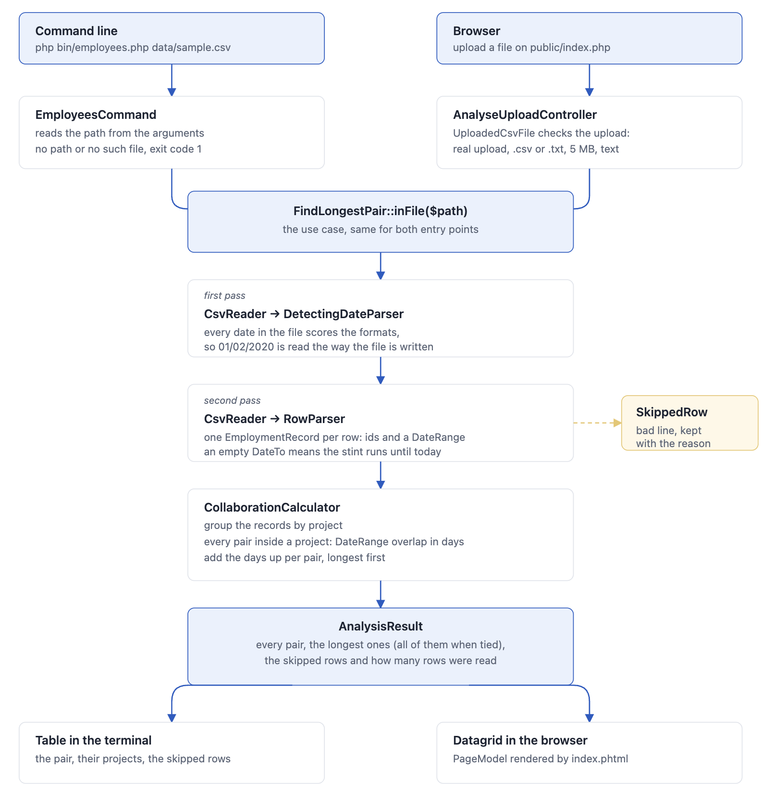

# Employees

[](https://github.com/vonodnatsyalokin/Nikolay-Andonov-employees/actions/workflows/ci.yml)

Finds the pair of employees who have worked together on common projects for the longest period of time.

Input is a CSV file with the format `EmpID, ProjectID, DateFrom, DateTo`, where `DateTo` may be `NULL`, meaning the employee is still on the project.

## How it works

The command line and the browser are two ways into the same pipeline. Click the chart to open [`docs/flow.html`](docs/flow.html).

[](docs/flow.html)

## Requirements

- PHP 8.2+
- Composer

## Run it

Web interface — pick a CSV file, see the pair and all their common projects:

```bash
composer install
php -S localhost:8000 -t public
```

Then open <http://localhost:8000> and upload `data/sample.csv`.

With Docker instead, on <http://localhost:8008>:

```bash
docker compose up --build
```

Command line:

```bash
php bin/employees.php data/sample.csv
```

```
Longest working pair: 143 and 412, 487 days worked together

Employee ID #1  Employee ID #2  Project ID  Days worked
143             412             10          482
143             412             12          5

Skipped 1 of 11 rows:
  line 12: DateFrom: "2015-13-40" is not a date in any supported format.
```

## Tests

```bash
composer test   # PHPUnit
composer stan   # PHPStan, level max
```

## Structure

- `src/Domain` — the business rules: date ranges, employment records, the pair calculation. Knows nothing about files.
- `src/Input` — reading the outside world: CSV files and the many date formats they contain.
- `src/Application` — the use case that ties the two together and reports what it had to skip.
- `src/Cli`, `src/Web`, `bin`, `public` — the two ways into the application.

## Assumptions

- Both the first and the last day count, so `2020-01-01` to `2020-01-02` is two days.
- `DateTo` reading `NULL`, `-` or `n/a` is treated the same way as an empty string.
- If several pairs tie for the longest time, all of them are shown.
- The same employee can appear on a project more than once; the stints are treated separately and their days added up.
- A row that cannot be read is skipped and reported with its line number, so one bad line does not cost the whole file. A file that cannot be read at all is an error.
- The header line is optional and detected automatically. `,`, `;`, tab and `|` all work as separators.
- Many date formats are supported, and a file may mix them. A value none of them matches is passed to `strtotime` as a last resort, which is lenient: `yesterday` is a date to it, and `2020-02-30` becomes 1 March. Guessing is preferred over losing the row.
- Ambiguous values such as `01/02/2020` are read the way the rest of the file is written: the dates of the whole file are looked at first, and `13/05/2020` anywhere in it makes the file day first, `05/13/2020` makes it month first. A file that gives nothing away is read day first.

## Notes

The CSV reading is written by hand. In a real project this would be a battle tested package such as `league/csv`, but here the parsing is part of what the task is about, so it did not feel right to hand it off.

## About AI usage

The solution is designed by me and I own every single line of it - AI model was used for the code typing part - only after the design part was ready.

The task is intentionally not AI harnessed - no skills, no rules, no agent instructions, no guardrails, etc.
